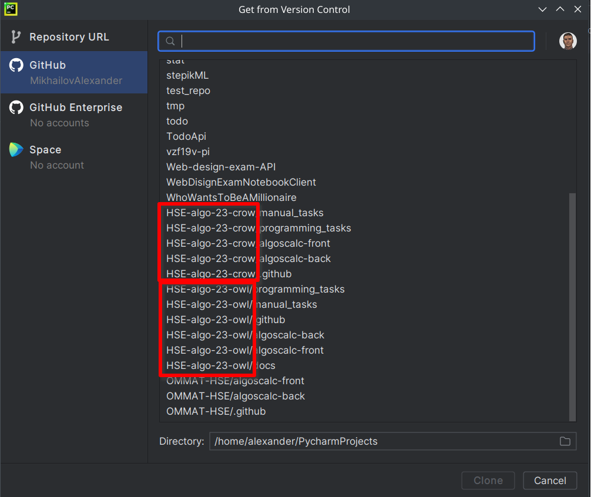
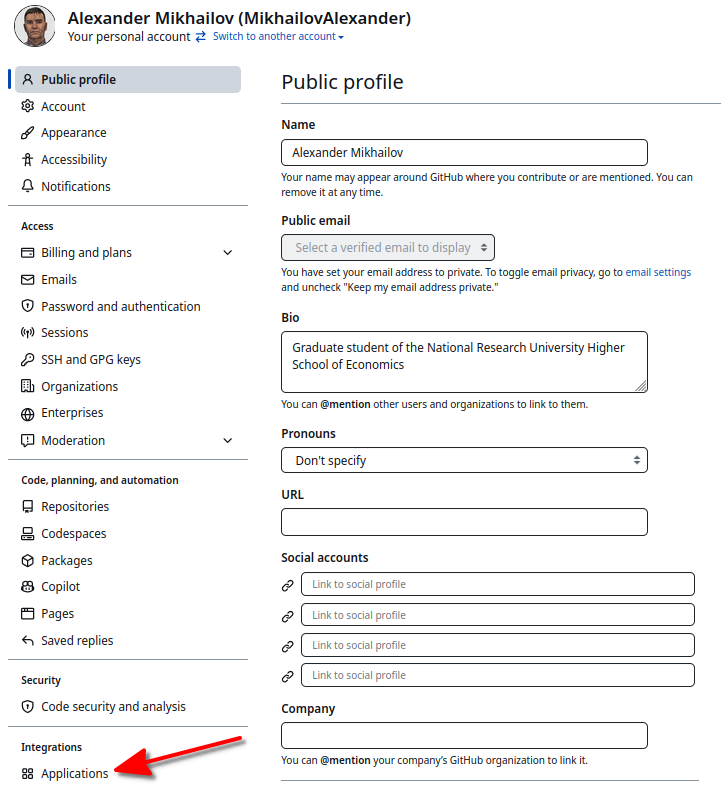
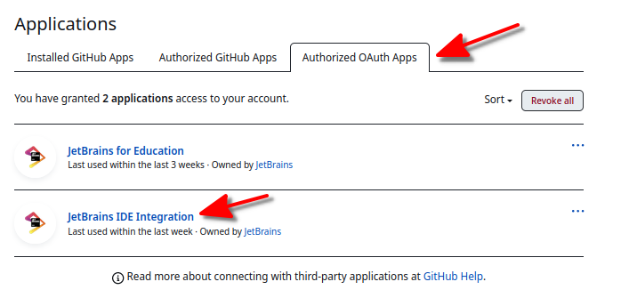
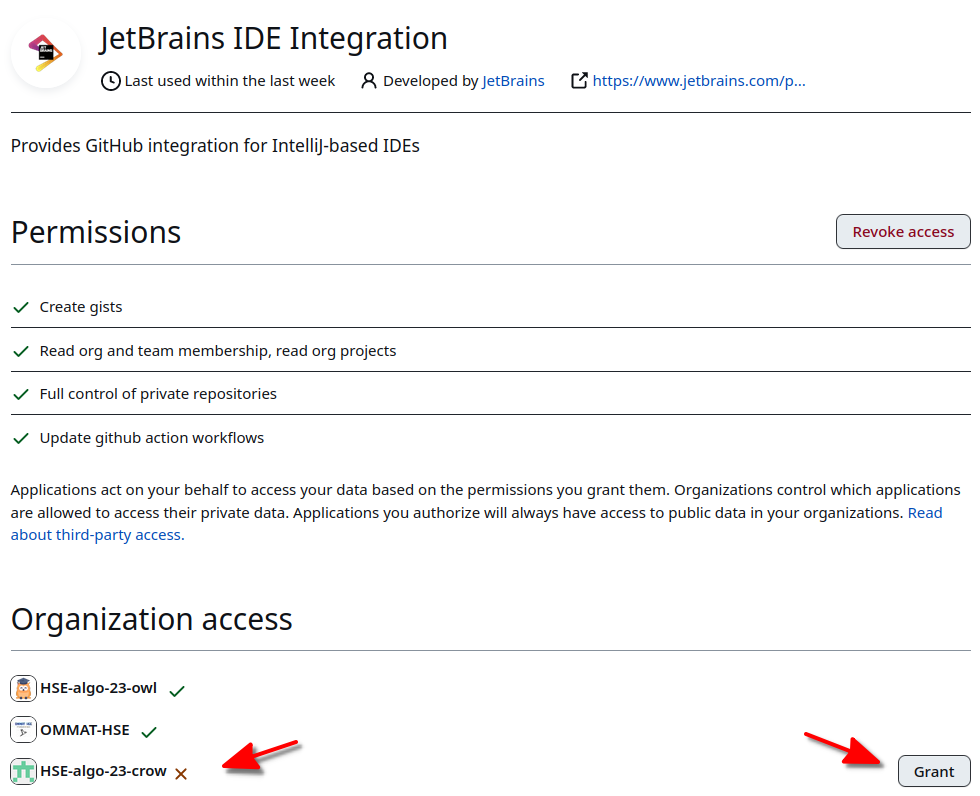

# Настройка доступа к репозиториям организации
После установки IDE Pycharm и настройки в IDE учетной записи GitHub необходимо клонировать на свою машину репозитории организации. Репозитории должны отображаться на вкладке GitHub, перед названием репозитория должно быть указано название организации.

**Если репозитории организации в списке отсутствуют**, то необходимо внести изменения в настройки GitHub-аккаунта (вкладка Settings). В настройках необходимо выбрать раздел Applications, расположенный внизу списка.

В разделе Applications необходимо перейти на вкладку с приложениями с OAUTH авторизацией и перейти в настройки приложения IDE Pycharm.

В нижней части вкладки приложения IDE Pycharm указаны организации, данные которых могут быть предоставлены приложению. Необходимо нажать кнопку Предоставить (Grant), после чего в IDE Pycharm будут доступны репозитории организации.

